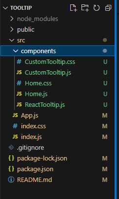

# Tooltip using React app
A simple tooltip component that appears when hovered over a button using react app.

## Features included
* #### Custom Tooltip ####
  Tooltip created from sratch using span element

* #### React Tooltip ####
  Tooltip using the in-build react tooltip component

* #### Tooltip Position ####
  Position of the tooltip is passed as a prop argument

* #### Tooltip Content ####
  Content of the tooltip is passed as a prop argument

## Folder structure
  
  * src
    * components
      * CustomTooltip : component which takes care of custom tooltip 
      * Home: component that acts as a container for the other tooltip components
      * ReactTooltip: component which takes care of react tooltip
    * App: component which acts a container for all the other components
    * index: the entry point of the project

## Links
1. [Code link](https://github.com/Meghna24R/Tooltip)
2. [Hosted link](https://meghna24r.github.io/Todo-List-App/)